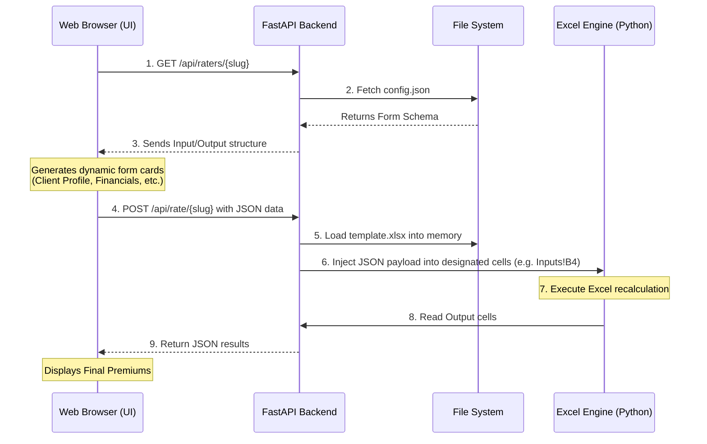

# Excel-to-Web Rating Engine: Project Overview & Architecture

This document provides a comprehensive overview of the **Hybrid Rating Engine** platform. It explains how the system translates actuarial and pricing Excel models into functional web applications automatically, bypassing the need to recode complex formulas into Python or JavaScript.

---

## 1. Executive Summary

The platform allows pricing teams and actuaries to continue building complex models in Microsoft Excel. By simply adding a standardized `_Schema` tab to their workbook, our system automatically:
1. Generates a dynamic, validation-enforced web interface.
2. Exposes a secure REST API for that specific Excel model.
3. Handles real-time rating calculations by passing web inputs directly into the intact Excel engine and retrieving the calculated outputs.

---

## 2. System Architecture & Components

The application is built on a lightweight, decoupled stack:

- **Frontend (Vanilla HTML/JS/CSS):** Dynamically generates UI forms based on a configuration file. It knows nothing about insurance or pricing logic; it simply reads rules dictating what text boxes and dropdowns to render.
- **Backend (Python / FastAPI):** The orchestration layer. It handles API requests, parses the Excel `_Schema` tab into JSON, and utilizes Python-based Excel execution libraries to map values, trigger calculations, and extract results.
- **Data Layer (File System):** 
  - `templates/<rater_name>/template.xlsx`: The original Excel file with the `_Schema` tab.
  - `templates/<rater_name>/config.json`: A generated map of inputs, outputs, and UI rules.

### Workflow Diagram

---

## 3. The `_Schema` Standard

The "magic" of the application relies on an 8-column standard format within a hidden `_Schema` tab in every uploaded workbook. This strictly defined contract allows the system to bridge the gap between web UI and Excel:

| slug | cell | type | label | io | group | options | default |
|---|---|---|---|---|---|---|---|
| `issue_age` | `'Inputs & Outputs'!D4` | `number` | Issue Age | `input` | Client Profile | | `30` |
| `currency` | `'Inputs'!D10` | `text` | Currency | `input` | Policy Settings | `HKD;USD` | `HKD` |

- **Routing:** The `cell` column handles cross-sheet coordination (telling Python exactly where to write/read).
- **Validation:** The `options` column restricts what the frontend allows, avoiding "N/A" errors by forcing exact matches (like `HKD` instead of user typos).

---

## 4. API Endpoints

1. **`GET /api/raters`**: Lists all available rating engines found in the `templates/` directory.
2. **`GET /api/raters/{slug}`**: Returns the `config.json` defining the fields, default values, and structure needed to render the UI for a specific rater.
3. **`POST /api/rate/{slug}`**: The core calculation engine. Accepts a JSON body of user inputs. The backend injects these into `template.xlsx`, computes the formulas, and responds with the calculated outputs.
4. **`POST /api/admin/reload`** (Admin): Forces the backend to rescan the directories and regenerate configs if a schema has been updated.

---

## 5. Performance Differences: MPL vs. PAR & PC Rating

**Observation:** The MPL Rater returns premium results almost instantaneously, while the PAR Model and PC Rating model possess noticeable execution times (a few seconds).

**Explanation:** 
This difference is inherent to how Excel calculates mathematical dependency trees in the background.

*   **The MPL Rater** is relatively straightforward. It has a localized set of rules and outputs. Updates to input variables trigger a shallow calculation chain.
*   **The PAR Model and PC Rating Models** are significantly heavier files (e.g., PAR Model is ~1.06 MB) comprising many interconnected worksheets and vast actuarial lookup tables. 
    *   When the Python engine injects a value (like "Sex: M"), it invalidates the current state of the workbook.
    *   The engine must rebuild the dependency graph and re-evaluate deep chains of `VLOOKUP`s, `INDEX/MATCH`es, and potentially thousands of interconnected matrix calculations across multiple `RateTables` and `Inputs` sheets before finalizing the final output cell.

Because we are processing the **real Excel logic in memory**—guaranteeing 100% mathematical parity with the actuarial source-of-truth—we inherit Excel's exact computational workload. Larger models directly scale the calculation time.

---

## 6. Future Expansion: Dual-Mode Routing

While standard models act as straight "Flat" schemas (1-to-1 input-to-cell maps), the architecture has been future-proofed to support **"Schedule" mode** (e.g., Oakbridge). This allows dynamic looping (adding infinite rows of vehicles or properties to an Excel table and clearing unused rows automatically) using the exact same backend engine.